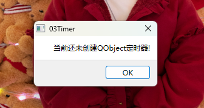

# QT学习笔记
## 1 Qt Creator
### 1.1 QR安装
- 可使用教育许可
- 在安装时组件里勾选上qt版本以及其对应的mingw，这样创建项目时就会自动添加kit

### 1.2 基本
如widget这样的窗口，会生成widget.cpp来存放构造函数和析构函数。对于界面设计，qt存放于widget.ui的文件中，可在设计页面中打开

界面与MFC中界面类似，左侧为各种控件：
- layout 布局
- spacers 弹簧
- button 按钮
- Item views（Model-Based） 单元视图
- Item Widgets（Item-Based）单元控件
- containers 容器
- Input widgets 输入
- Display widgets 显示

在界面的右上角，可以更改你所添加对象的对象名，有助于在编写代码时区分，其次在右下角为属性，与MFC类似

## 2 信号与槽
### 2.1 新建槽的方法
1. 在控件上右键点击添加槽，会在widget.cpp中自动生成代码；
2. 直接在widget.h文件中添加成员函数，再在widget.cpp的构造函数中，将信号与槽相连接；
3. 可以直接在连接信号与槽时，在connect函数中写好函数的代码；

### 2.2 添加一个进程
以001中模仿WIN+R的运行窗口为例，按下确定键后，先从cmdLineEdit->text()中读取进程名称，再创建一个process对象（这里需要先在头文件中添加好 QProcess 头文件）。代码如下：
```cpp
Widget::Widget(QWidget *parent)
    : QWidget(parent)
    , ui(new Ui::Widget)
{
    ui->setupUi(this);

    //连接信号与槽
    connect(ui->cmdLineEdit,SIGNAL(returnPressed()),this,SLOT(on_commitButton_clicked()));
    connect(ui->cancelButton,&QPushButton::clicked,this,&Widget::on_cancelButton_clicked);
    connect(ui->browseButton,&QPushButton::clicked,[this]()
    {
        QMessageBox::information(this,"信息","点击浏览");
    });
}

Widget::~Widget()
{
    delete ui;
}

void Widget::on_commitButton_clicked()
{
    //获取lineedit数据
    QString program = ui->cmdLineEdit->text();
    //创建process对象
    QProcess *myProcess = new QProcess(this);
    myProcess->start(program);
}

void Widget::on_cancelButton_clicked()
{
    this->close();
}
```

### 2.3 001模仿运行窗口的界面设计


### 2.4 总结
在看信号与槽时，总觉得这里的内容和MFC中消息队列和消息处理函数基本一致，实际上两者间确实差别不大，通过用户对于控件做出的动作读取信号（消息队列），再执行消息对应的槽（消息处理函数）。

### 2.5 Qt实现四则运算器
#### 2.5.1 界面设计

使用grid layout布局，分别设置了最小高度和最大宽度，使得页面看上去还行
#### 2.5.2 程序设计
在类Widget中添加一个私有变量expression，当每次按下数字或者符号时，令expression += "数字或符号";再在上方numEdit中更新ui->numEdit->setText(expression);当最后按下等号键时，进行计算，代码如下：
```cpp
void Widget::on_calButton_Cal_clicked()
{
    char opt[128] = {};
    int i = 0,tmp = 0,num1,num2;
    QStack<int> numStk;
    QStack<char> symStk;


    // QString a = "123";
    // QByteArray ba;
    // ba.append(a);
    // 出现报错error: no matching function for call to 'QByteArray::append(QString&)'
    // 164 |     ba.append(a);
    // 如果你想把QString添加到QByteArray，你需要先把QString转换为QByteArray。
    // 你可以使用QString::toUtf8()或者QString::toLatin1()函数来实现这个转换
    QByteArray ba;
    ba.append(expression.toUtf8());
    strcpy(opt,ba.data());//将expression中的内容给了opt数组

    while(opt[i] != '\0'||symStk.empty()!=true)//在C++中，单引号表示单个字符，双引号表示字符串
    {
        //当为数字时
        if(opt[i] >= '0' && opt[i] <= '9')
        {
            tmp = tmp*10 + opt[i]-'0';
            if(opt[i+1] >= '0' && opt[i+1] <= '9')
            {

            }
            else
            {
                numStk.push(tmp);
                tmp = 0;
            }
            i++;
        }
        //当为字符时
        else
        {
            //当栈顶符号的优先级低于当前符号时，或栈顶为前括号当前不为后括号（没看懂后面一点，先不写试试）
            if(symStk.empty() == true ||getPri(opt[i])<getPri(symStk.top())||(symStk.top() == '(' && opt[i] != ')'))
            {
                symStk.push(opt[i]);
                i++;
                //为什么要continue？
                continue;
            }
            if (symStk.top() == '(' && opt[i] == ')')
            {
                symStk.pop();
                i++;
                continue;
            }
            //当栈顶符号优先级高于当前符号，或者读到了后括号，并且当前不是末尾\0且栈顶不为空
            if(getPri(opt[i]) >= getPri(symStk.top())||(opt[i] == ')' && symStk.top()!='(')||(opt[i] != '\0'||symStk.empty()!=true))
            {
                char ch = symStk.top();
                symStk.pop();
                switch(ch)
                {
                    case '+':
                        num1 = numStk.top();
                        numStk.pop();
                        num2 = numStk.top();
                        numStk.pop();
                        numStk.push(num1 + num2);
                        break;
                    case '-':
                        num1 = numStk.top();
                        numStk.pop();
                        num2 = numStk.top();
                        numStk.pop();
                        numStk.push(num1 - num2);
                        break;
                    case '*':
                        num1 = numStk.top();
                        numStk.pop();
                        num2 = numStk.top();
                        numStk.pop();
                        numStk.push(num1 * num2);
                        break;
                    case '/':
                        num1 = numStk.top();
                        numStk.pop();
                        num2 = numStk.top();
                        numStk.pop();
                        numStk.push(num1 / num2);
                        break;
                }
            }
        }
    }
    // expression = expression.number(numStk.pop());
    expression = QString::number(numStk.pop());
    ui->numEdit->setText(expression);
}

//获得符号的优先性,越小优先级越高
int getPri(char c)
{
    switch(c)
    {
    case '+':
    case '-':
        return 2;	//如果是加减，返回2
        break;
    case '*':
    case '/':
        return 1;	//如果是乘除，返回1
        break;
    case '(':
        return 0;  
        break;
    }
    return 3;//非字母
}
```

在这个程序中用了两个栈来存储，一个储存数字，一个储存符号，先将expression通过数组ba转换，再将ba使用strcpy给opt，这样expression中的字符变成了opt的一个字符串。随后开始检索字符串分别对于数字和符号进行入栈。当需要进行计算时（检索到最后/当前优先级小于栈顶符号的优先级/读到了后括号），便将符号栈顶的弹出，根据弹出的符号进行计算，再将计算好的数字压回数字栈。计算完成后，返回数字栈栈顶的数字给expression，用到了QString::number()默认十进制返回。再次更新numEdit。

## 3 定时器
### 3.1 QObject定时器
作为大部分派生类的基类，QObject类提供了定时器来使用，使用startTimer来创建定时器
```cpp
// interval即为定时时间，单位为毫秒
int startTimer(int interval, Qt::TimerType timerType = Qt::CoarseTimer);
int startTimer(std::chrono::milliseconds time, Qt::TimerType timerType = Qt::CoarseTimer);
```
这两个`startTimer`函数的主要区别在于它们接受的时间间隔参数的类型和精度。

1. `int startTimer(int interval, Qt::TimerType timerType = Qt::CoarseTimer);`
   这个函数接受一个整数作为时间间隔，单位是毫秒。这意味着你不能指定比毫秒更精确的时间间隔。例如，如果你想要一个每0.5毫秒触发一次的定时器，你不能使用这个函数，因为它的参数是整数。

2. `int startTimer(std::chrono::milliseconds time, Qt::TimerType timerType = Qt::CoarseTimer);`
   这个函数接受一个`std::chrono::milliseconds`类型的参数，这是C++11引入的新的时间处理库。这个库可以处理各种不同的时间单位，包括小时、分钟、秒、毫秒、微秒和纳秒。所以，使用这个函数，你可以创建一个精度更高的定时器。

总的来说，如果你需要的定时器精度不高，可以使用第一个函数。如果你需要更高的精度，应该使用第二个函数。


同时也提供了killTimer来结束定时器
```cpp
//id 为startTimer返回的创建定时器的ID
void killTimer(int id);
```
#### 3.1.1 图片循环播放器界面设计

其中label用于显示图片，Start开始循环播放，End暂停循环播放，没有开始便按下End后，会弹出MessageBox提示定时器未创建。

#### 3.1.2 定时器代码设计
```cpp
//构造函数中先显示出第一张图片
Widget::Widget(QWidget *parent)
    : QWidget(parent)
    , ui(new Ui::Widget)
{
    ui->setupUi(this);
    
    //QPixmap类中存储了图片路径
    QPixmap pix("D:\\Study\\QT\\project\\03\\img\\20240101江汉路跨年-1.jpg");
    ui->label->setPixmap(pix);
    imgID = 2;
    ui->label_2->setText("Timer1ID == "+QString::number(Timer1));
}

void Widget::timerEvent(QTimerEvent *event)
{
    if(event->timerId()!=Timer1)
    {
        return;
    }

    QString path = "D:\\Study\\QT\\project\\03\\img\\20240101江汉路跨年-";
    path += QString::number(imgID);
    path += ".jpg";
    QPixmap pix(path);
    ui->label->setPixmap(pix);
    imgID++;
    if(imgID == 40)
    {
        imgID = 1;
    }
}
```
当开始了定时器后，在定时器TimerEvent函数中处理，TimerEvent函数是由QObject类继承而来的虚函数，在这里进行重载，完成我们想完成的功能。
### 3.2 QTimer定时器
在QT中提供了QTimer类来进行定时器操作现在Widget类中定义一个QTimer指针，在用指针创建定时器。
使用start()函数开启定时器
```cpp
//msec代表定时时间，单位为毫秒
void start(int msec);
```
使用stop()函数来暂停定时器
```cpp
void stop();
```
#### 3.2.1 图片循环播放器界面设计
 
#### 3.2.2 代码设计
```cpp
void Widget::TIM1_IRQHandler()
{
    QString path = "D:\\Study\\QT\\project\\03\\img\\20240101江汉路跨年-";
    path += QString::number(imgID);
    path += ".jpg";
    QImage img;
    img.load(path);
    ui->label->setPixmap(QPixmap::fromImage(img));
    imgID++;
    if(imgID == 40)
    {
        imgID = 1;
    }
}
```
这次使用QImage类来显示图片，当label调用setPixmap时，先容QPixmap::fromImage来转换成QPixmax类。大体上与之前相同，目前都是只简单的使用了路径，没有对图片进行更改操作
显示效果如图：
